<h1 align="center">WithCare</h1>

<p align="center">
  <b>Healthcare navigation, with care.</b><br />
  A multi-agent AI care-navigation assistant for India — for you, your family, and your pets.
</p>

<p align="center">
  <i>Gemini reasons · typed tools act · a knowledge graph remembers · code-level guardrails supervise.</i>
</p>

<table align="center">
  <tr>
    <td align="center" width="250" valign="top">
      <h3>☁️ Live Demo</h3>
      <sub>The app, live on Google&nbsp;Cloud</sub><br/><br/>
      <a href="https://withcare-501007.web.app"></a>
    </td>
    <td align="center" width="250" valign="top">
      <h3>🎬 Demo Video</h3>
      <sub>3-min walkthrough: worry&nbsp;→&nbsp;actions</sub><br/><br/>
      <a href="https://drive.google.com/file/d/1sIDDV1ikFnoOqNnpevLZCvdCnnpMpLkM/view?usp=drive_link"></a>
    </td>
  </tr>
  <tr>
    <td align="center" width="250" valign="top">
      <h3>📑 Pitch Deck</h3>
      <sub>The final deck (.pptx)</sub><br/><br/>
      <a href="docs/withcare.pptx"></a>
    </td>
    <td align="center" width="250" valign="top">
      <h3>💻 Source</h3>
      <sub>Browse the code on GitHub</sub><br/><br/>
      <a href="https://github.com/charansai-1411/WithCare"></a>
    </td>
  </tr>
</table>

> ⚠️ **WithCare provides navigation assistance only. It is not medical advice and never diagnoses, doses, or interprets results.**


---

## The Problem

In India, the hardest part of healthcare often isn't the medicine — it's the **navigation**. A caregiver managing a parent with diabetes has to answer, alone and across a dozen websites:

- *Which* hospital nearby has the right specialty and accepts our scheme?
- *Which* government scheme (Ayushman Bharat / PM-JAY, Aarogyasri, CGHS…) or private policy actually covers this person?
- Where's the cheapest strip of this medicine or a BP monitor?
- What does this insurance policy / lab report actually say?
- How do I keep appointments and medicine reminders in sync across the family?

This burden falls hardest on non-experts caring for **others** — elderly parents, children, even pets. WithCare turns one natural-language concern into a coordinated, auditable set of actions, and shows its work.

## Who it's for — and the reach

WithCare's primary segment is the ~60–70 million Indian households managing chronic care for an elderly parent (173M Indians aged 60+, 2026 NCP projection; ~40% with a chronic condition, LASI). The same navigation engine — facility lookup, reminders, coverage, document Q&A — extends to any dependent in the household: the 100M+ families managing a child's health, and India's fast-growing base of pet-owning households. **One care-navigation layer, every dependent under one roof.**

## What WithCare Does

A caregiver in Hyderabad opens WithCare, adds a **care profile** for their mother (68, type-2 diabetes, hypertension), and simply chats. WithCare:

- **routes** the concern to the right specialist agents,
- **grounds** every external fact in real data (Maps, Firestore, Google Search, the user's own uploaded documents),
- **remembers** the person in a per-profile knowledge graph so it never re-asks,
- **gates** every irreversible or clinical action in code, and
- **shows proof** — an inspectable "N specialists consulted" trace and result cards.

---

# Full System Architecture

WithCare's core idea: **separate reasoning from action.** Gemini decides *what* to do from natural language; typed tools with code-level guardrails decide *whether and how* it actually happens.

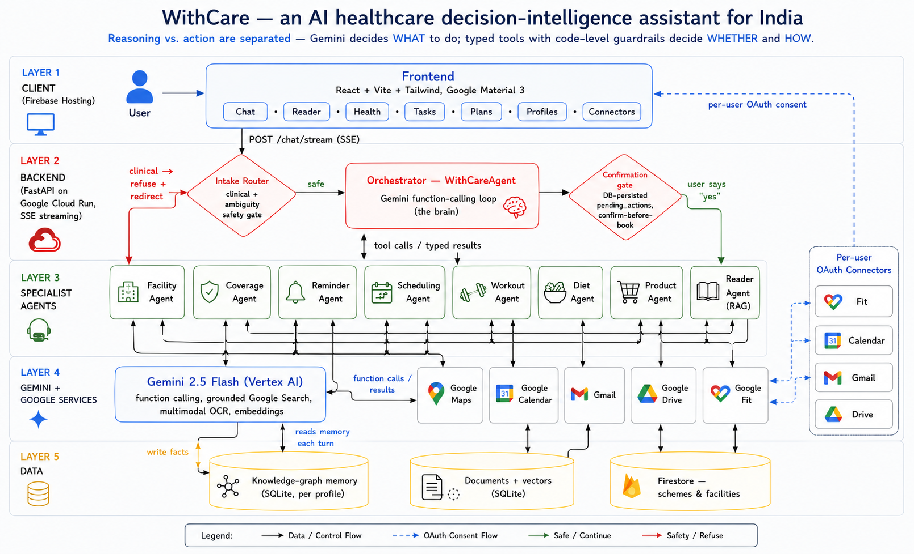

### Request lifecycle (one turn)

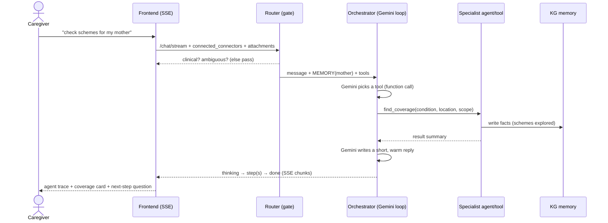
```mermaid
sequenceDiagram
  actor U as Caregiver
  participant FE as Frontend (SSE)
  participant R as Router (gate)
  participant O as Orchestrator (Gemini loop)
  participant T as Specialist agent/tool
  participant M as KG memory
  U->>FE: "check schemes for my mother"
  FE->>R: /chat/stream + connected_connectors + attachments
  R-->>FE: clinical? ambiguous? (else pass)
  R->>O: message + MEMORY(mother) + tools
  O->>O: Gemini picks a tool (function call)
  O->>T: find_coverage(condition, location, scope)
  T->>M: write facts (schemes explored)
  T-->>O: result summary
  O->>O: Gemini writes a short, warm reply
  O-->>FE: thinking → step(s) → done (SSE chunks)
  FE-->>U: agent trace + coverage card + next-step question
```

**Why this architecture — and why only this:**

- **Reasoning vs. action are separated on purpose.** The LLM is powerful but non-deterministic; letting it *decide* is great, letting it *execute unchecked* is dangerous. So Gemini only emits **typed function calls**, and every consequential path is enforced in **code**, not prompt text.
- **Guardrails live in control flow, not the prompt** — clinical refusal (pre-loop), a DB-persisted confirm-before-booking gate, a bounded tool loop, argument validation, and connector gating. A model can be jailbroken; a code gate cannot.
- **Everything external is grounded.** Facilities (Maps + Firestore), coverage (Firestore + Google Search), documents (the user's own files), prices (grounded Search) — never model memory. This is what keeps a healthcare tool honest.
- **Streaming (SSE) makes the work inspectable** — the UI shows each agent as it runs, so the user (and a judge) sees *proof of work*, not a black box.
- **Why not a single mega-prompt or a hardcoded intent switch?** A mega-prompt can't enforce irreversible-action safety and hallucinates data; a hardcoded switch can't handle the messy, multi-step, multilingual reality of caregiver questions. The function-calling loop + typed tools is the smallest design that is both flexible *and* safe.

## Scaling to millions

WithCare runs today on a **single, cost-efficient Cloud Run instance** (scales to zero, ~free when idle) with SQLite on a mounted GCS volume — deliberately lean for the prototype phase. Because the design is **serverless-first**, scaling out is a matter of removing *one* constraint, not re-architecting.

**The only real bottleneck is state.** The service is pinned to one instance purely because SQLite is a single-writer file. Move that state to a managed backend and the same **stateless** service fans out horizontally — Cloud Run already auto-scales *and* load-balances across instances, so there are **no VMs or hand-managed load balancers to run**.

```
Global HTTPS Load Balancer + Cloud CDN + Cloud Armor (WAF)     ← custom domain, edge cache, DDoS
        │
        ▼
Cloud Run  (stateless · auto-scales 1 → N behind its built-in LB)
        ├─▶ Firestore / Cloud SQL / AlloyDB   — durable state (replaces single-writer SQLite)
        ├─▶ Memorystore (Redis)               — cache hot profiles, memory slices & sessions
        ├─▶ Vertex AI Vector Search           — document embeddings at scale (replaces JSON-in-SQLite)
        ├─▶ Cloud Tasks / Pub-Sub             — async doc ingest, embeddings, calendar/email fan-out
        └─▶ Vertex AI (Gemini)                — provisioned throughput for steady, low-latency QPS
```

- **Stateless compute** — every request already carries its own context (active profile, per-user OAuth token); once state lives in a managed DB, `--max-instances` simply goes up and Cloud Run does the rest.
- **Serverless, not VMs** — Cloud Run auto-scales and balances load itself; no instance groups, health checks, or patching to manage.
- **Cost stays flat per request** — Firestore reads, cached memory slices, and async embedding keep the per-request LLM cost roughly constant as traffic grows.

The path is designed-in: we run lean now *on purpose*, and turn the dials when real load arrives.

---

# Subagent Architectures

Each specialist does one thing well, returns typed `SourcedStep`s (so the frontend renders consistent cards), and writes durable facts to the knowledge graph. Below: each agent as a hand-drawn illustration, a real screenshot, and the design rationale.

## 0. Orchestrator — `WithCareAgent` (the root agent)

The brain of the loop. Loads the active person's memory, exposes the toolbox to Gemini, runs a bounded function-calling loop, and enforces the hard guardrails.

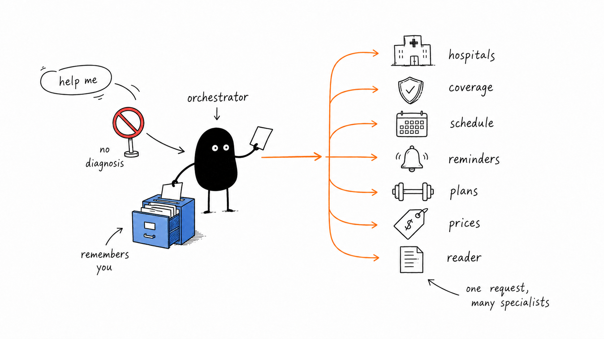

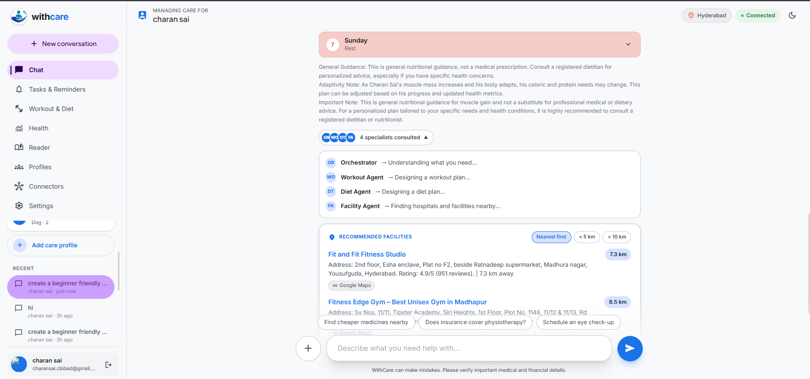

**Why this:** a function-calling loop lets Gemini compose multiple tools for one request ("find a hospital *and* book it") from plain language, using the injected memory to avoid re-asking.
**Why only this:** the loop is **bounded** (step cap), tools are **validated**, and irreversible/clinical paths are intercepted *outside* the model — so the flexibility of an agent never becomes an unsafe action.

## 1. Intake Router — safety gate

Runs **before** the loop. A keyword fast-path catches obvious clinical asks instantly; otherwise Gemini classifies `is_clinical` / `is_ambiguous`.

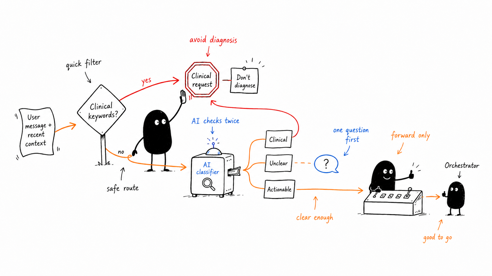

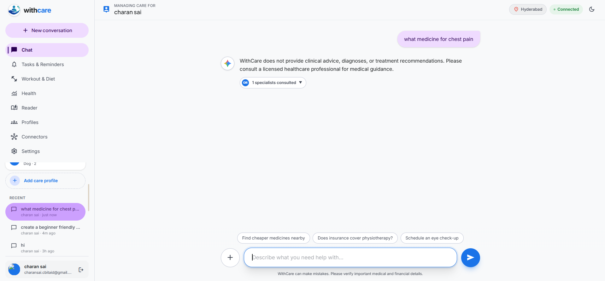

**Why this:** the cheapest, most reliable safety is to decide *before* spending tokens or touching tools. The fast-path is free and instant; the LLM handles nuance ("schemes for her diabetes" is navigation, not clinical).
**Why only this:** asking the main model to self-police mid-conversation is unreliable and hard to audit — a dedicated, logged gate is deterministic and testable.

## 2. Facility Agent — find the right hospital, nearby and real

Curated India facilities (Firestore) + Gemini ranking + **live Maps** enrichment (real distance, rating, link), reconciled through one reverse-geocode so coordinates and city never disagree; sorted nearest-first.

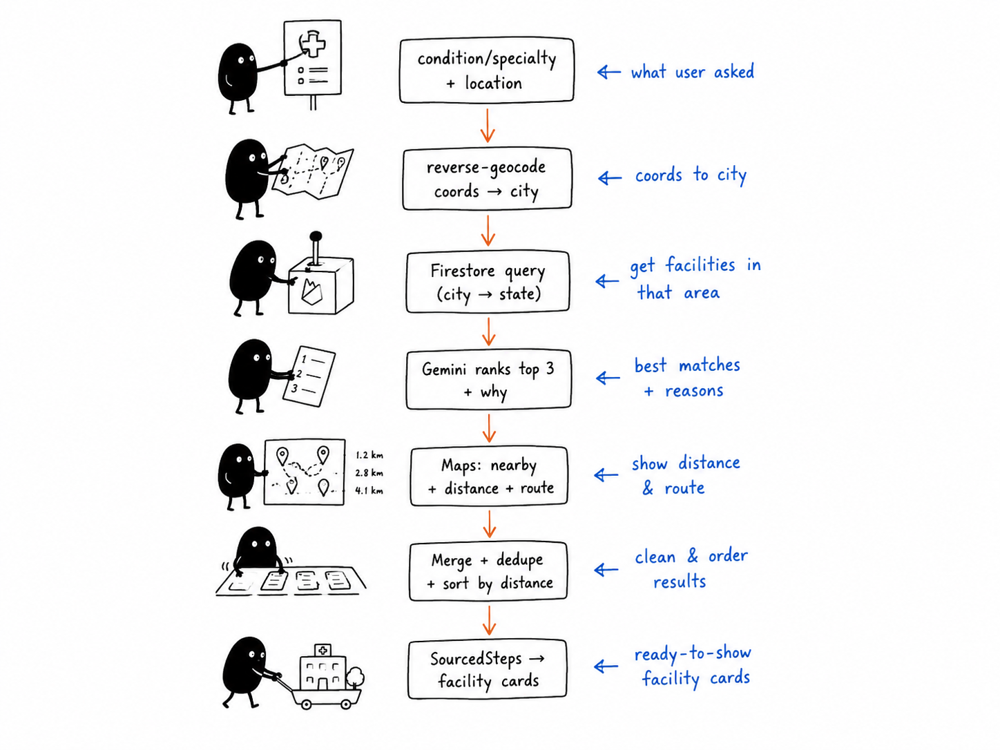

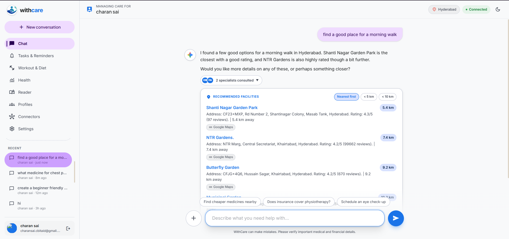

**Why this:** Firestore gives *curated, scheme-aware* Indian hospitals; Maps gives *live* proximity, rating and a clickable pin; Gemini explains *why* each fits. Together they're both trustworthy and current.
**Why only this:** a pure-LLM hospital list hallucinates addresses and distances. Grounding in Firestore + Maps yields results a caregiver can actually call and drive to.

## 3. Coverage Agent — `scheme_agent` (government + private)

Government schemes come from curated **Firestore**; private insurance comes **live from Google Search grounding**, parsed through a **self-correcting JSON loop** so a bad LLM format can never break the UI.

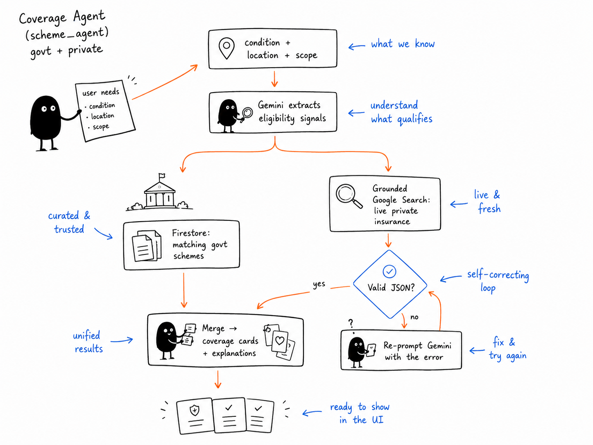

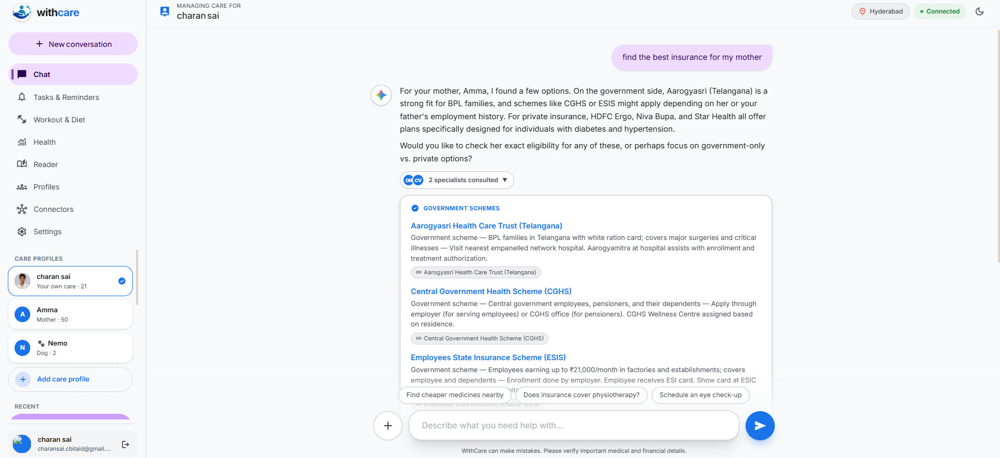

**Why this:** government schemes are stable and belong in a curated store; private plans change constantly and must be fetched **live**. The self-correcting loop turns fragile grounded output into reliable structured cards.
**Why only this:** a static insurance list goes stale; ungrounded LLM output invents plans and URLs. Split sourcing + self-correction balances freshness with reliability.

## 4. Reminder Agent — deterministic, per-person

No LLM inside — the orchestrator already extracted the args. It resolves the recipient, creates a recurring **Calendar** event (RRULE + notify-N-min-before), best-effort **Gmail**, and records the reminder in memory. Date parsing never raises.

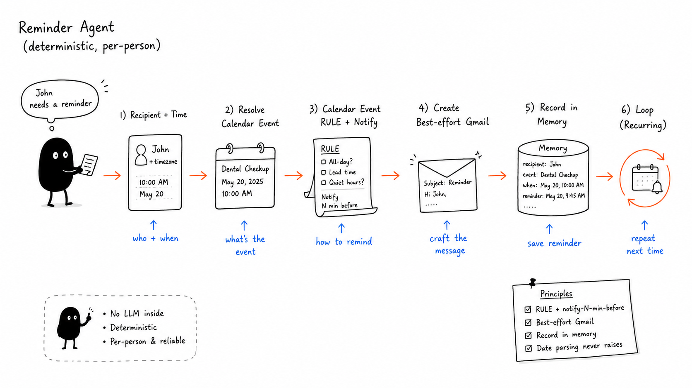

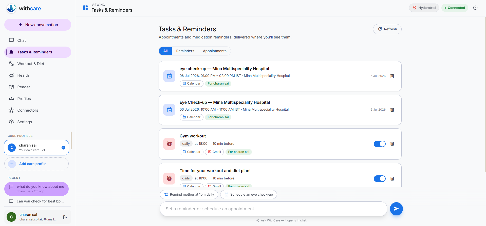

**Why this:** once the intent is structured, execution should be **deterministic** — robust date handling ("tomorrow", weekday names, ISO), per-person delivery, and a truthful report ("saved, but couldn't email — check the connection").
**Why only this:** letting the LLM hand-format calendar payloads risks malformed events and silent failures; a deterministic executor with a never-raise date parser is safe and predictable.

## 5. Scheduling Agent — `action_agent` (confirm-before-book)

Booking is **irreversible**, so the orchestrator can only **stage** it (persisted in `pending_actions`); the user's explicit "yes" is the *only* path that commits. On commit: Calendar event, optional family-calendar sync (with consent), an optional Drive care-plan doc, and a memory write.

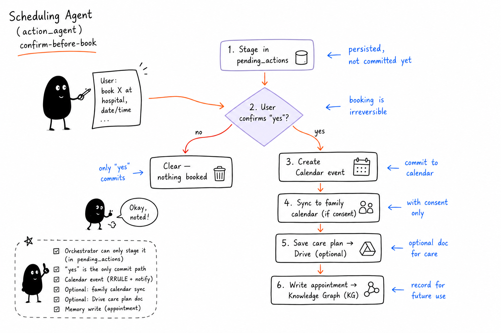

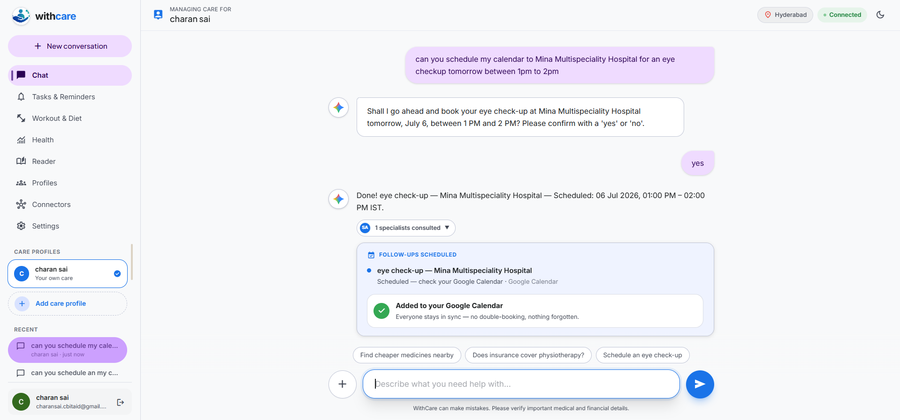

**Why this:** a hard, DB-persisted **stage → confirm → commit** flow means an irreversible action can only ever happen on an explicit human "yes" — the model cannot self-authorize.
**Why only this:** auto-booking on an LLM's word is unacceptable for real calendars and family members; staging is the only design that makes the human the final authority.

## 6. Workout Agent & 7. Diet Agent — tailored, adaptive plans

Both read the person's KG profile (age, gender, weight, height, conditions) + a required **goal**, generate a structured weekly/7-day plan with Gemini, and store **one plan per profile** (a new plan supersedes the old). The **diet plan coordinates with the current workout plan** — more fuel on training days.

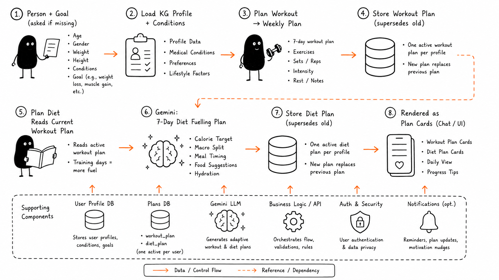

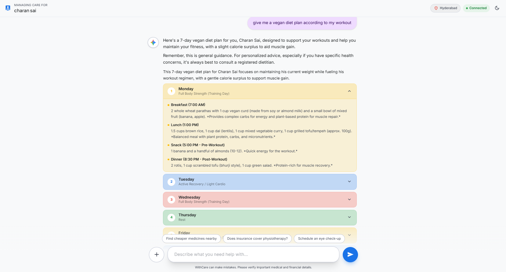

**Why this:** plans are only useful if they fit *this* person and adapt as health changes; storing structured plans in the KG lets both chat and the Plans view render the same source of truth.
**Why only this:** generic, re-asked plans ignore the profile; one-plan-per-type keeps history clean and supports the "plans adapt as you improve" story. Coordinating diet with the stored workout is what makes them a program, not two disconnected lists.

## 8. Product Agent — price-compare across stores

The user names a product (a device, supplement, or a medicine **they named**); grounded Google Search finds listings across Amazon / Flipkart / PharmEasy / Apollo / 1mg / Netmeds, normalized and **sorted cheapest → costliest**, with a "Cheapest" tag, real links, and a self-correcting JSON parse.

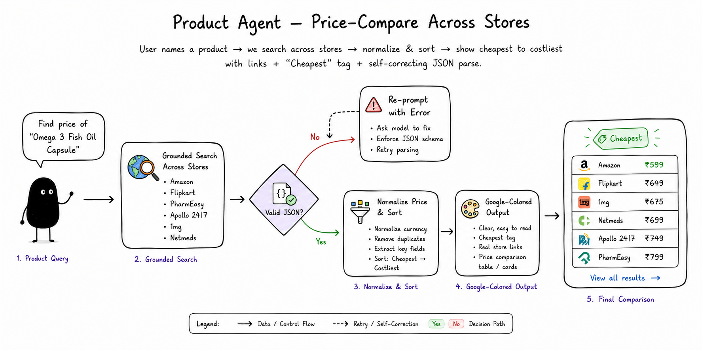

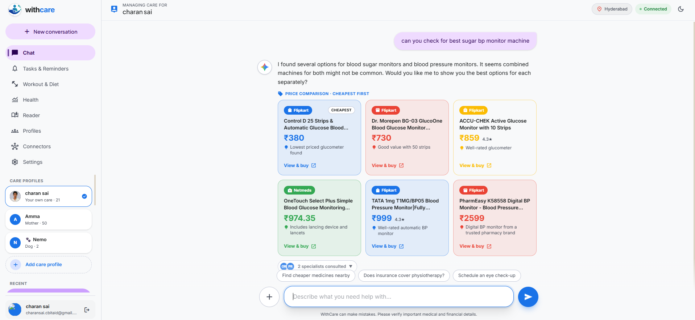

**Why this:** grounded Search gives **real store links and indicative prices** with no scraper cost and no dependency on a fragile/paid API — and it's structured to swap in real scraping later.
**Why only this:** live per-store scraping is costly and brittle; the agent only compares what the user asked for and **never suggests or doses a medicine** — a hard safety line.

## 9. Reader Agent — RAG over the user's own documents

Upload → Gemini multimodal **OCR** (reads scans & photos, not just text PDFs) → chunk → **embed** (`text-embedding-004`) → store vectors. A question embeds → **cosine top-k** → Gemini answers **only from the excerpts**, citing the document. Files attached in chat inject their text directly so "read this image" works.

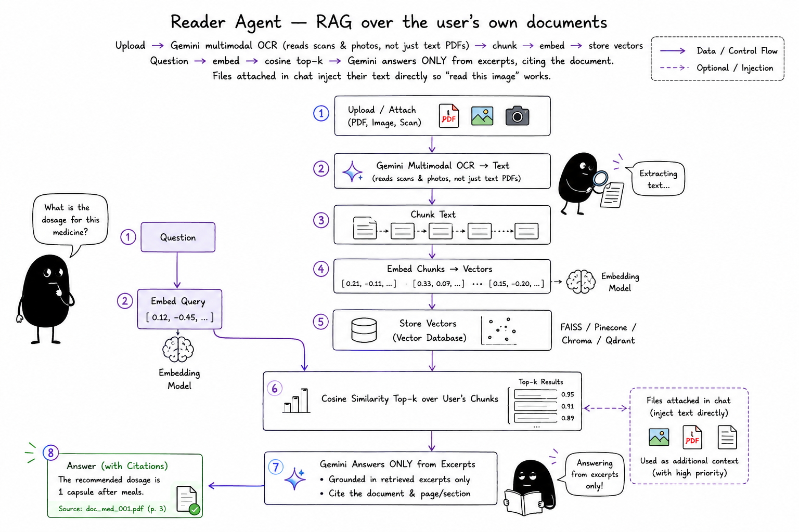

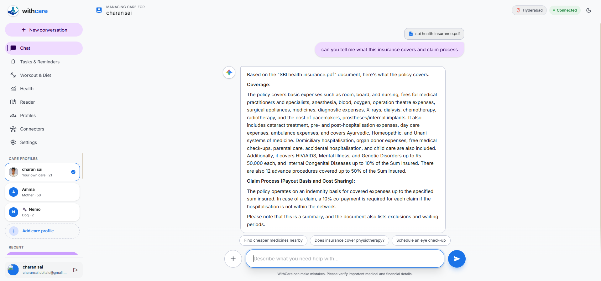

**Why this:** grounded, cited document Q&A is the safe way to answer "what's my room-rent limit?" — the model can't invent, only quote. Multimodal OCR means a phone photo of a prescription works.
**Why only this:** stuffing whole documents into every prompt is expensive and lossy; chunk-embed-retrieve is the standard scalable RAG pattern, and answer-only-from-excerpts is what prevents hallucinated medical figures.

## ⋆ Memory — the per-profile Knowledge Graph (shared substrate)

Not an agent, but what makes them all coherent. Every agent writes typed facts (`condition`, `medication`, `appointment`, `scheme`, `insurance`, `workout_plan`, `diet_plan`, `reminder`, `health_metric`…) as nodes linked to the person; a compact, token-cheap slice is injected into every LLM turn.

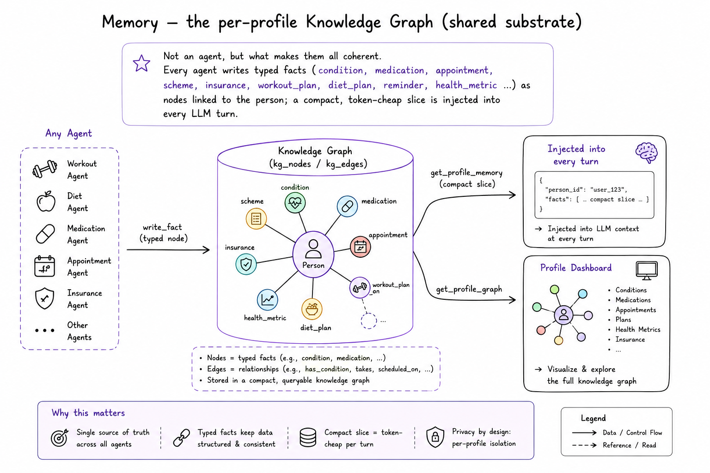

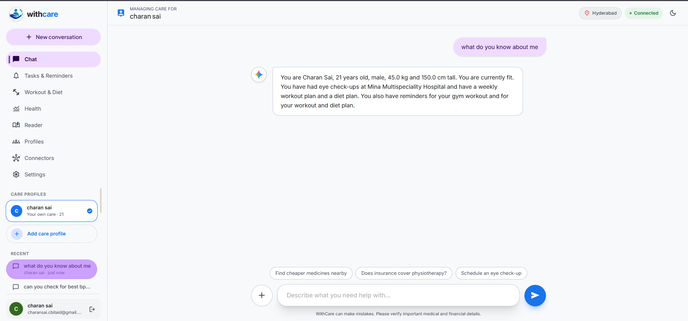

**Why this:** structured, typed memory is compact enough to inject every turn, so WithCare **never re-asks** what it knows and stays useful across sessions and across the whole family.
**Why only this:** replaying raw chat history is expensive and noisy; a typed graph is queryable, renders the Profile/Plans/Tasks views, and can migrate to a real graph DB later without changing callers. See [`withcare-backend/MEMORY.md`](withcare-backend/MEMORY.md) for the schema.

---

## ⋆ Skills — markdown playbooks that steer the agents

The knowledge graph is one shared substrate; **skills** are the other — and the reason WithCare's behavior is tunable *without touching code*. A skill is a **markdown playbook** in [`withcare-backend/skills/`](withcare-backend/skills/) that defines *how* an agent behaves: its voice, its decision rules, its output format, and worked examples. At runtime `load_skill()` injects the relevant playbook into that agent's Gemini turn — so the model's **reasoning** is guided by an editable playbook, while its **actions** stay pinned by the typed tools and code guardrails.

| Skill | What it steers |
|-------|----------------|
| [`orchestrator.md`](withcare-backend/skills/orchestrator.md) | The root agent — when to answer directly vs. call a tool, card-vs-prose output style, and per-domain playbooks (coverage, facilities, scheduling, reminders, plans, products, recall, editing). |
| [`workout.md`](withcare-backend/skills/workout.md) · [`diet.md`](withcare-backend/skills/diet.md) | The rigid, card-parseable **`Day N:`** plan format the UI renders, plus age/condition/goal-aware tailoring. |
| [`reader.md`](withcare-backend/skills/reader.md) | Answering **strictly** from the user's own uploaded documents, with citations. |
| [`coverage.md`](withcare-backend/skills/coverage.md) | Government-scheme + private-insurance search and India-specific eligibility phrasing. |

**Why this:** separating *policy* (how an agent talks and decides) from *mechanism* (the typed tools + guardrails in code) means product behavior can be reviewed, versioned, and refined in plain English — no logic redeploy to fix a phrasing or tighten an output format.
**Why only this:** hard-coding these rules as inline Python prompt strings would bury product decisions in code and make them hard to audit; a folder of focused, version-controlled playbooks keeps each agent's behavior explicit. The `skills/` folder is packaged into the container image and loaded at startup.

---

## Design — inspired by Google Material 3

WithCare's interface is **inspired by Google's [Material 3 (Material You)](https://m3.material.io/)** design language:

- **M3 color roles & tokens** — surfaces, primary / secondary / tertiary, containers and their `on-` colors, defined as CSS variables and mapped into Tailwind, with a full **light + dark** theme (a Google Workspace-style night palette).
- **Google product accent colors** (blue · red · green · yellow) used *semantically* — in result cards, the Health charts, and the "N specialists consulted" agent trace.
- **M3 typography, shape & elevation** — a Google Sans / Roboto-style type scale, rounded `card` and `action` corner radii, and layered M3 elevation shadows.
- **M3 motion** — emphasized easing, container-transform and fade-through transitions, ripples and state layers, plus a Gemini-style "thinking" shimmer while the specialists are coordinated.
- **Material 3 data-visualization** styling for the Health dashboard (steps, heart-rate, blood-pressure) charts.

> ⚠️ **Trademark & logo notice.** *Google*, *Gemini*, *Material Design*, and all related names, logos, and marks are trademarks of **Google LLC**. Any Google / Gemini / Google-product logos or imagery appearing in this project are used **solely for a hackathon demo and educational purposes**. We do **not** own them and claim **no rights, ownership, or affiliation**. WithCare is an independent student project built for the Google Gen AI Hackathon and is **not affiliated with, sponsored by, or endorsed by Google**.

---

## Tech Stack

| Layer | Choice |
|------|--------|
| Frontend | React + Vite, Tailwind, **Material 3** design system, SSE streaming |
| Backend | **FastAPI** + `sse-starlette` (Server-Sent Events) |
| Reasoning | **Gemini 2.5 Flash** via **Vertex AI** — function calling, grounded Google Search, `text-embedding-004` |
| Agent core | Custom function-calling orchestrator + modular **skills** (`skills/*.md`) |
| Google services | Calendar, Gmail, Drive, Maps, Fit (per-user **OAuth consent**) |
| Data | SQLite (users, profiles, conversations, **knowledge graph**, documents+vectors, pending actions); **Firestore** (schemes, facilities) |
| Safety | Pre-loop clinical gate · DB-persisted confirm-before-book · step cap · arg validation · connector gating |

## Project Structure

```
WithCare/
├── withcare-backend/                # FastAPI service — the multi-agent core
│   ├── app/
│   │   ├── main.py                   # App entry, routes, SSE /chat/stream
│   │   ├── config.py                 # Settings (env, project, Vertex AI)
│   │   ├── orchestrator/
│   │   │   ├── agent.py              # Gemini function-calling loop + guardrails
│   │   │   └── router.py             # Pre-loop clinical / ambiguity safety gate
│   │   ├── agents/                   # Specialist agents (one job each)
│   │   │   ├── base_agent.py         #   shared base
│   │   │   ├── facility_agent.py     #   hospitals + gyms/parks/pools (Maps)
│   │   │   ├── scheme_agent.py       #   government schemes
│   │   │   ├── insurance_agent.py    #   private insurance
│   │   │   ├── reminder_agent.py     #   per-person reminders
│   │   │   ├── action_agent.py       #   scheduling (confirm-before-book)
│   │   │   ├── workout_agent.py      #   tailored workout plans
│   │   │   ├── diet_agent.py         #   tailored diet plans
│   │   │   └── product_agent.py      #   medicine/device price-compare
│   │   ├── tools/                    # Typed integrations the agents call
│   │   │   ├── maps_tool.py          #   Places / Geocoding / Distance
│   │   │   ├── calendar_tool.py      #   Google Calendar (per-user OAuth)
│   │   │   ├── gmail_tool.py  drive_tool.py
│   │   │   ├── firestore_tool.py     #   schemes / facilities
│   │   │   └── bigquery_tool.py
│   │   ├── services/                 # Cross-cutting services
│   │   │   ├── gemini_service.py     #   Gemini (Vertex AI) client
│   │   │   ├── memory_service.py     #   per-profile knowledge graph
│   │   │   ├── reader_service.py     #   RAG over user documents
│   │   │   ├── embedding_service.py  #   text-embedding-004
│   │   │   ├── grounding.py  skills.py  auth_service.py
│   │   ├── routes/                   # REST endpoints (auth, profiles, kg, reader, conversations)
│   │   ├── models/                   # Pydantic request/response + care_plan
│   │   ├── db/database.py            # SQLite schema (profiles, KG, docs, pending actions)
│   │   ├── data/                     # Seed JSON (facilities, schemes, medicines)
│   │   └── utils/                    # logger, exceptions
│   ├── skills/                       # Markdown playbooks that steer the agents
│   │   ├── orchestrator.md
│   │   ├── workout.md  diet.md  reader.md  coverage.md
│   ├── scripts/                      # Firestore ingest + OAuth setup
│   ├── tests/                        # Unit + eval suites
│   ├── Dockerfile  cloudbuild.yaml   # Cloud Run build/deploy
│   ├── requirements.txt  .env.example
│   └── MEMORY.md  README.md
│
├── withcare-frontend/               # React + Vite chat UI (Material 3)
│   ├── src/
│   │   ├── App.jsx  main.jsx         # App shell, routing, auth + connector state
│   │   ├── components/
│   │   │   ├── ChatThread.jsx  Sidebar.jsx  Tutorial.jsx
│   │   │   ├── PlanCards.jsx  ProductCards.jsx  CarePlanCard.jsx
│   │   │   ├── AgentFlowAnimation.jsx  MemoryManager.jsx  ...
│   │   │   ├── views/               #   Chat, Reader, Health, Tasks, Plans, Profiles, Connectors, Settings
│   │   │   └── ui/                  #   Buttons, Charts, Loaders, Gemini badges
│   │   ├── hooks/useChat.js         # Chat state + SSE client
│   │   ├── services/                # api.js, connectorsService.js, themeService.js, ...
│   │   └── constants/agents.js      # Agent → icon-badge mapping
│   ├── public/                      # logo, icons, favicon
│   ├── index.html  tailwind.config.js  vite.config.js
│   ├── firebase.json                # Firebase Hosting
│   └── package.json  .env.example  README.md
│
├── docs/                            # Illustrations, screenshots, pitch deck
├── DEPLOY.md                        # Cloud Run + Firebase deploy runbook
└── README.md
```

## Setup

**Prerequisites:** Python 3.11+, Node 18+, a Google Cloud project with Vertex AI enabled (`gcloud auth application-default login`); optional Maps API key, Web OAuth Client ID, and Calendar/Drive OAuth token.

**Backend**
```bash
cd withcare-backend
python -m venv .venv && . .venv/Scripts/activate      # or: source .venv/bin/activate
pip install -r requirements.txt
cp .env.example .env          # GCP_PROJECT_ID, GOOGLE_MAPS_API_KEY, GOOGLE_OAUTH_CLIENT_ID, ...
python scripts/setup_auth.py  # optional: generates token.json for Calendar/Drive/Gmail
uvicorn app.main:app --reload --port 8001
```

**Frontend**
```bash
cd withcare-frontend
npm install
cp .env.example .env          # VITE_API_URL=http://localhost:8001
npm run dev                    # http://localhost:5173
```

## Safety, Trust & Scope

WithCare is a **hackathon prototype**, not a medical device. It is designed to *navigate* care, not replace clinicians. It refuses diagnosis/treatment/dosing (for people and pets), grounds external facts in real data, and requires explicit confirmation before any irreversible action. Real deployment would still require clinical validation, privacy/legal review, durable human-in-the-loop state, and formal medical safety review.

## Security

Secrets are **git-ignored** and never committed: `.env`, `token.json`, `client_secret*.json`, `service-account*.json`, and the SQLite `*.db`. Use the `.env.example` templates.

---

## The WithCare ecosystem at a glance

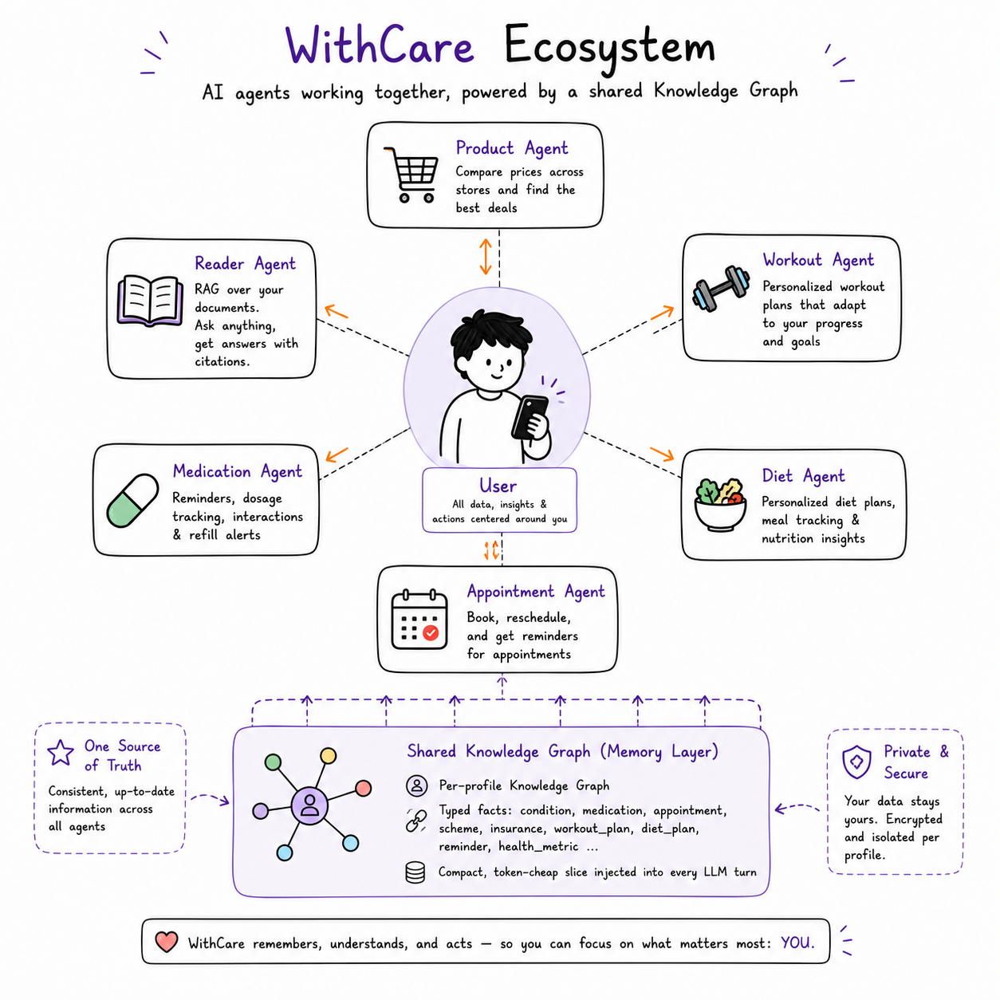

---

<p align="center"><b>WithCare</b> · Built for the Google Gen AI Hackathon</p>
